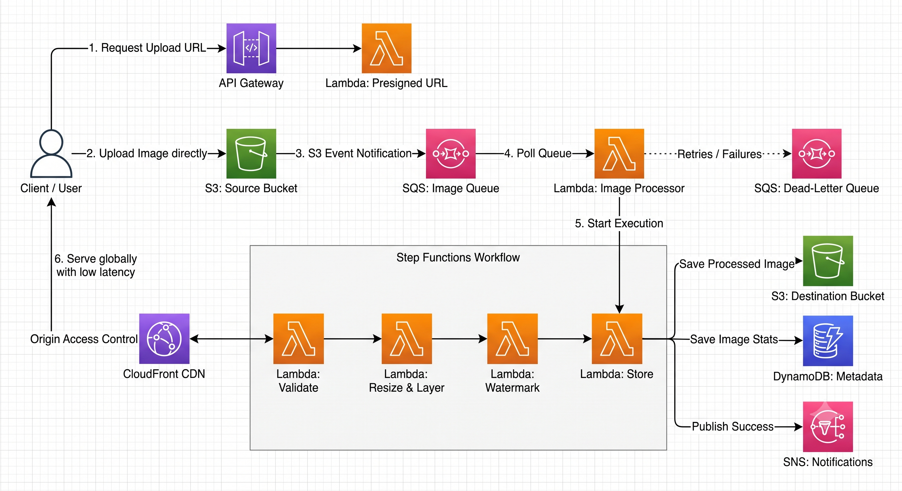

# Serverless Image Processing Pipeline (AWS)

This repository contains the Infrastructure as Code (Terraform) and Python Lambda functions for a fully serverless, event-driven image processing pipeline on AWS.

Images uploaded to a source S3 bucket trigger an SQS queue, which invokes an AWS Step Functions state machine to validate, resize, watermark, and store the image alongside its metadata. The finalized images are then served globally via Amazon CloudFront.

## 🏗️ Solution Architecture Diagram



## 📋 Prerequisites

To deploy and test this project from your local machine, ensure you have the following installed and configured:

* **Windows OS:** The commands provided in this guide are tailored for Windows Command Prompt (`cmd.exe`) and PowerShell.
* **Python (3.11+):** Required to download the `Pillow` dependencies using `pip`.
* **Git:** Required to clone this repository.
* **Terraform (v1.5.0+):** The Infrastructure as Code tool used to deploy the AWS resources.
* **AWS CLI:** Installed and configured with your Administrator credentials (`aws configure`).

🚀 Deployment Instructions

1. Clone the Repository
   Open your Windows terminal and clone the project:

**DOS**

```Shell
git clone <YOUR_GITHUB_REPO_URL>
cd "Serverless Image Processing Pipeline"
```

2. Package the Pillow Lambda LayerAWS Lambda runs on Amazon Linux. We must download the specific Linux binaries for the Pillow library and zip them into a layer, regardless of the local Windows environment.  Run the following commands in Command Prompt (cmd.exe):

**DOS**

```Shell
mkdir python && pip install --platform manylinux2014_x86_64 --target ./python --implementation cp --python-version 3.11 --only-binary=:all: Pillow
tar -a -c -f pillow_layer.zip python
```

(See AWS Lambda Pillow Layer – ZIP Packaging Process_2.png for reference).

3. Deploy the Infrastructure via Terraform
   Initialize Terraform, validate the syntax, and deploy the architecture.

Run these commands in your terminal:

**DOS**

```Shell
terraform init
terraform fmt && terraform validate main.tf
terraform apply -auto-approve
```

*(See `Terraform_Deploying.png` and `Terraform_Success.png` for reference).*

Once complete, Terraform will output your `api_upload_endpoint` and `cloudfront_domain_name`.

## 🧪 Testing the Pipeline

You can automate the generation of the pre-signed URL and the subsequent image upload using Windows  **PowerShell** .

Ensure you have a test image (e.g., `architecture.png`) in your current directory, then run the following commands in  **PowerShell** :

```PowerShell
# 1. Fetch the Pre-signed URL from API Gateway and parse the JSON response
$response = curl.exe "$(terraform output -raw api_upload_endpoint)?filename=architecture.png" | ConvertFrom-Json

# 2. Upload the local image directly to the S3 bucket using the parsed URL
curl.exe -X PUT -T "architecture.png" -H "Content-Type: image/png" "$($response.uploadUrl)"
```

(See `Testing_PresignedURL_Upload.png` for reference).

### Verification Steps :

1. SNS Notification: Check your email for a success alert (ensure you confirmed the SNS subscription first).
2. Step Functions: Open the AWS Console to view the visual state machine execution.
3. DynamoDB: Check the project2-image-metadata table to view the stored dimensions and file attributes.
4. CloudFront: View your finalized, watermarked image in your browser using the CloudFront domain output: https://<YOUR_CLOUDFRONT_DOMAIN>/processed/architecture.png.

## ⚠️ Clean Up (Crucial Step)

To avoid incurring ongoing AWS charges, you must destroy the infrastructure when you are finished testing.

Run the following command:

**DOS**

```Shell
terraform destroy -auto-approve
```
